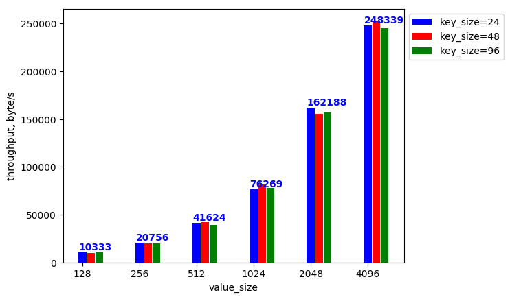
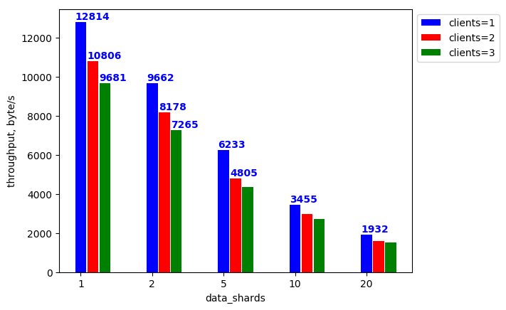
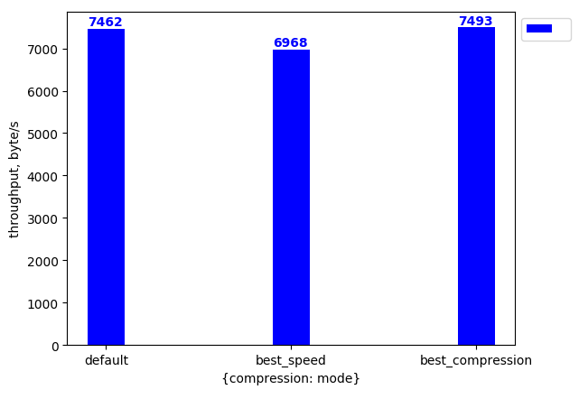
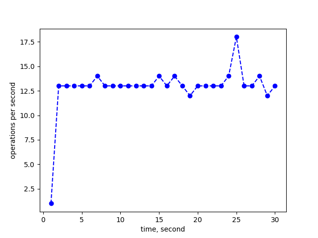

# zstor benchmark

`zstor benchmark` provides tools to analyse the performance of `zstor`.

## Getting started

Download the `zstor` repository.
```bash
go get -u -d github.com/zero-os/0-stor/cmd/zstorbench
```

Install the `zstor` components by running following command in the root dir of the repository:
```bash
cd $GOPATH/src/github.com/zero-os/0-stor
make install
```

Make sure `etcd` is installed if benchmarking with `etcd` as metadata server. On how to install `etcd`, check the [etcd documentation](https://coreos.com/etcd/docs/3.2.4/index.html).
Zstor requires	etcd 3.2.4 or any higher stable release.

If you don't have python you'll have to install this first,
on top of that you'll need `tkinter`, as this is a dependency for `matplotlib`, a python library we use to generate graphs. Here is how you install those on the different *NIX OS families:

OS | instructions |
|---|---|
Ubuntu / Debian | `sudo apt-get install python3-tk`
Fedora (`dnf`) | `sudo dnf install python3-tkinter`
using `yum`<br>(e.g. Fedora or CentOS) | `sudo yum install python3-tkinter`
MacOS (`brew`) | `# If you don't have Xcode command line tools`<br>`Xcode-select install`<br>`# If you don't have Tcl/Tk brew installation (check brew list)`<br>`brew install homebrew/dupes/tcl-tk`<br>`# if python was not installed with option --with-tcl-tk`<br>`brew uninstall python3`<br>`# install python again linking it to the brew installed Tcl/Tk`<br>`brew install python3 --with-tcl-tk`

Install python dependencies of the orchestrator:

```bash
cd $GOPATH/src/github.com/zero-os/0-stor
pip3 install -r benchmark/orchestrator/requirements.txt
```

To start the benchmarking, provide a YAML [config file](#orchestrator-config-file) for the `benchmark orchestrator` (`0-stor/benchmark/orchestrator/orchestrator.py`) and run the `orchestrator` Python script:
``` bash
python3 orchestrator.py --conf bench_config.yaml
```

Orchestrator flags:
```
usage: orchestrator.py [-h] [-C string] [--out string]

optional arguments:
  -h, --help            help for orchestrator
  -C,  --conf string     path to the config file (default bench_config.yaml)
  --out, string          directory where the benchmark report will be
                        written (default ./report)
```

## Benchmark orchestrator
  
The orchestrator sets up a benchmarking environment (zstordb and etcd metadata servers) and uses [`zstorbench`](/cmd/zstorbench/README.md) to collect the performance data. The orchestrator will generate the config files with scenarios and environment configuration for [`zstorbench`](/cmd/zstorbench/README.md) and process the output (of multiple zstorbench runs) to generate a report.

### Orchestrator config file

Config file for the `benchmark orchestrator` consists of three parts (main fields):

  * `benchmarks`: configuration of what to benchmark
  * `template`: template configuration for [`zstorbench`](/cmd/zstorbench/README.md) client
  * `profile`: defines the type of profiling that's done during benchmarking

The `benchmarks` field contains information to build the benchmarking scenarios. In case if `benchmarks` is not provided, the benchmark will run for a single set of parameters, provided in the `template`.

The config for each benchmark is marked by the `prime_parameter` field and an optional `second_parameter` field can be defined. Inside both `prime_parameter` and `second_parameter` field the `id` specifies what zstor config field is being benchmarked. The `range` field specifies the different values for that zstor config field being used in the benchmarks.

If only `prime_parameter` is given, the `orchestrator` creates a plot of the throughput versus values in `range` of the `prime parameter`.
If both `prime_parameter` and `second_parameter` are given, a few plots will be combined in the output figure, one for each value in `range` of `second_parameter`.
Providing only a `second_parameter` will cause an error.

The `template` field represents the template of the config file for [`zstorbench`](/cmd/zstorbench/README.md).

Number of `zstordb` servers to be run is deducted from `distribution_data` + `distribution_parity`. The number of `etcd` metadata servers to be run is defined by `meta_shards_nr`.

The `iyo` field contains the credentials for [`itsyou.online`](https://itsyou.online), used for authentication during the benchmark. If the sub fields are empty or the `iyo` field itself is omitted, the benchmarks will run without authentication.  
If authentification is enabled, the `namespace` fields needs to be a valid [`itsyou.online`](https://itsyou.online) namespace, if authentification is disabled, any name can be used or it can be omitted for a random one to be generated.

The `profile` field sets the type of profiling done during benchmarking, if empty, invalid or omitted, no profiling will be done. Valid options are: `cpu`, `mem`, `block`, `trace`.

Example of a config file:
``` yaml
benchmarks: # (required) list of benchmark scenarios
- prime_parameter:    # (required) primary parameter of the benchmark *
    id: value_size    # (required) id of the primary parameter that is being benchmarked
    range: [1024, 2048, 4096] # (required) values of the primary parameter
  second_parameter:    # (optional) secondary parameter of the benchmark *
    id: key_size       # (required)id of the secondary parameter that is being benchmarked
    range: [24, 48, 96]  # (required) values of the primary parameter
- prime_parameter:
    id: data_shards   
    range: [1,2,5,10,20]
  second_parameter:
    id: clients
    range: [1, 2, 3]
- prime_parameter:    # primary parameter of the benchmark *
    id:
      compression: mode       # id of the secondary parameter that is being benchmarked
    range: [default, best_speed, best_compression]   
template: # config for benchmark client (zstorbench)
  zstor:  # zstor configuration
    iyo:  # If empty or omitted, the zstordb servers set up for the benchmark 
          # need to be run with the no-auth flag.
          # For benching with authentication, provide it with valid itsyou.online credentials
      organization: "bench_org"
      app_id: "an_iyo_bench_app_id"
      app_secret: "an_iyo_bench_app_secret"
    namespace: mynamespace  # If IYO credentials are provided,
                            # this needs to be a valid and existing IYO namespace,
                            # otherwise this can be any name or omitted
                            # and the namespace will be generated
    datastor:   # (optional, will use 1 data shard with default values if omitted) datastor config.
      pipeline:
        block_size: 4096
        compression:
          type: gzip
          mode: default
        distribution:
          data_shards: 2    # amount of data shards the orchestrator needs to setup for benchmarking
          parity_shards: 1  # amount of parity shards the orchestrator needs to setup for benchmarking
    metastor:               # (optional, will use 1 meta shard with default values if omitted) metastor config.
      meta_shards_nr: 2     # amount of metadata servers the orchestrator needs to setup for benchmarking
  benchmark:        # benchmark configuration
    clients: 1      # (optional, default 1) number of concurrent benchmarking clients
    method: write   # (optional) other options: read (default)
    result_output: per_second # (optional, default "") other options: "" (no per interval in result), per_minute, per_hour
    operations: 0     # (optional if duration specified) max number of operations(reads/writes) in benchmark **
    duration: 30      # (optional if operations specified) max duration of the benchmark **
    key_size: 48      # (required)
    value_size: 128   # (required)
    zstordb_jobs: 10  # (optional, default: 0) defines GOMAXPROCS for zstordb.
profile: cpu  # (optional, default: no profiling) other options: mem, block, trace

# * in the output figures 'prime_parameter.range' is used in the x-axis, while 'second_parameter.range' enables multiplot.
# ** if both 'operations' and 'duration' are given, the benchmarking stops on the first condition met.
```

## Orchestrator report

The orchestrator will put the generated report into the default folder (`./report`) or the one provided by the `--out` flag.

After the `orchestrator` has run, this folder wil contain a `report.md` Markdown file that contains:
* The config of the benchmark
* Generated figures of the run benchmarks 
* Textual representation of the graph

Example of a report Markdown file can be found [here](assets/example_report/report.md).

The field `result_output` defines a time interval to collect intermediate data throughout the benchmark and takes values `per_second`, `per_minute` or `per_hour`. These samples are used to create time plots during the benchmark. The time plots by default are collected in `timeplots.md` If `result_output` is empty or invalid time plots are not included.

Example of a time plot report Markdown file can be found [here](assets/example_report/timeplots.md).

The example reports are generated using the example config that can be found [here](assets/example_orchestrator_config.yaml).

If profiling was enabled, the profiling results can be found in the `profile_information` sub-folder.

Examples of generated figures for report.md:  
 
 
 

Example of a time plot 
 
