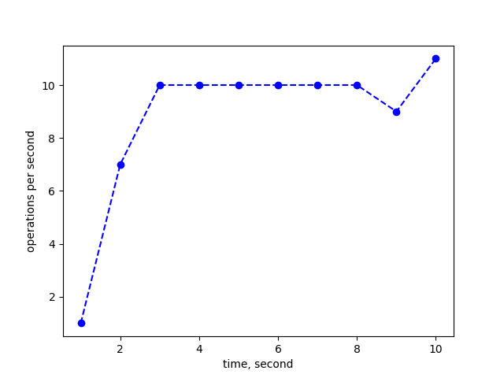
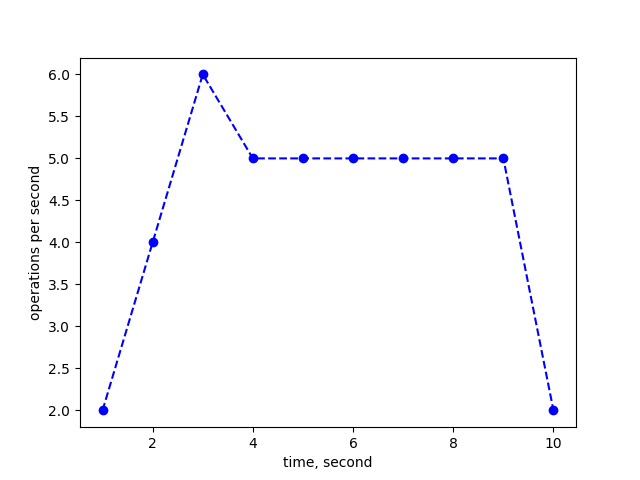
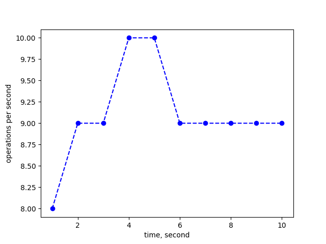
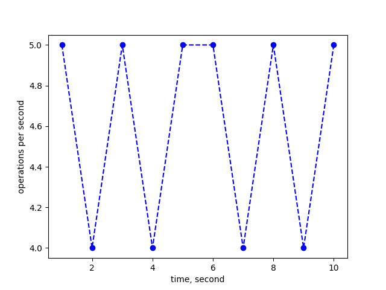
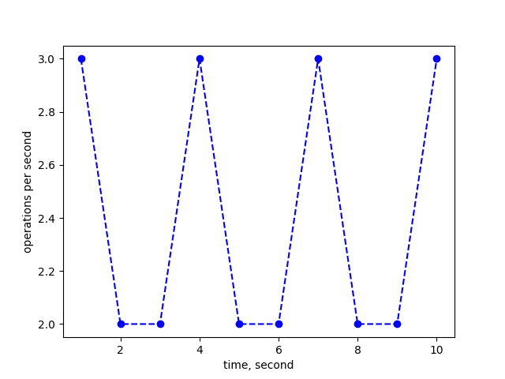

# Timeplot collection report
[Main report in here](report.md) 


 ## Timeplot 1 

**Config:**
```yaml 
benchmark:
  clients: 0
  duration: 10
  key_size: 48000
  method: write
  operations: 0
  result_output: per_second
  value_size: 1024000
zstor:
  datastor:
    pipeline:
      block_size: 4096
      compression:
        mode: ''
        type: snappy
      distribution:
        data_shards: 2
        parity_shards: 1
      encryption:
        private_key: ''
        type: aes
results:
- count: 88
  duration: 10.091811
  perinterval:
  - 1
  - 7
  - 10
  - 10
  - 10
  - 10
  - 10
  - 10
  - 9
  - 11
  - 0

```
 _____________ 

 

 ## Timeplot 2 

**Config:**
```yaml 
benchmark:
  clients: 0
  duration: 10
  key_size: 48000
  method: write
  operations: 0
  result_output: per_second
  value_size: 2048000
zstor:
  datastor:
    pipeline:
      block_size: 4096
      compression:
        mode: ''
        type: snappy
      distribution:
        data_shards: 2
        parity_shards: 1
      encryption:
        private_key: ''
        type: aes
results:
- count: 44
  duration: 10.04679
  perinterval:
  - 2
  - 4
  - 6
  - 5
  - 5
  - 5
  - 5
  - 5
  - 5
  - 2

```
 _____________ 

 

 ## Timeplot 3 

**Config:**
```yaml 
benchmark:
  clients: 0
  duration: 10
  key_size: 48000
  method: write
  operations: 0
  result_output: per_second
  value_size: 4096000
zstor:
  datastor:
    pipeline:
      block_size: 4096
      compression:
        mode: ''
        type: snappy
      distribution:
        data_shards: 2
        parity_shards: 1
      encryption:
        private_key: ''
        type: aes
results:
- count: 17
  duration: 10.160286
  perinterval:
  - 2
  - 2
  - 1
  - 1
  - 1
  - 2
  - 2
  - 2
  - 2
  - 2

```
 _____________ 

 

 ## Timeplot 4 

**Config:**
```yaml 
benchmark:
  clients: 0
  duration: 10
  key_size: 96000
  method: write
  operations: 0
  result_output: per_second
  value_size: 1024000
zstor:
  datastor:
    pipeline:
      block_size: 4096
      compression:
        mode: ''
        type: snappy
      distribution:
        data_shards: 2
        parity_shards: 1
      encryption:
        private_key: ''
        type: aes
results:
- count: 91
  duration: 10.041356
  perinterval:
  - 8
  - 9
  - 9
  - 10
  - 10
  - 9
  - 9
  - 9
  - 9
  - 9
  - 0

```
 _____________ 

 

 ## Timeplot 5 

**Config:**
```yaml 
benchmark:
  clients: 0
  duration: 10
  key_size: 96000
  method: write
  operations: 0
  result_output: per_second
  value_size: 2048000
zstor:
  datastor:
    pipeline:
      block_size: 4096
      compression:
        mode: ''
        type: snappy
      distribution:
        data_shards: 2
        parity_shards: 1
      encryption:
        private_key: ''
        type: aes
results:
- count: 46
  duration: 10.107678
  perinterval:
  - 5
  - 4
  - 5
  - 4
  - 5
  - 5
  - 4
  - 5
  - 4
  - 5
  - 0

```
 _____________ 

 

 ## Timeplot 6 

**Config:**
```yaml 
benchmark:
  clients: 0
  duration: 10
  key_size: 96000
  method: write
  operations: 0
  result_output: per_second
  value_size: 4096000
zstor:
  datastor:
    pipeline:
      block_size: 4096
      compression:
        mode: ''
        type: snappy
      distribution:
        data_shards: 2
        parity_shards: 1
      encryption:
        private_key: ''
        type: aes
results:
- count: 24
  duration: 10.31581
  perinterval:
  - 3
  - 2
  - 2
  - 3
  - 2
  - 2
  - 3
  - 2
  - 2
  - 3
  - 0

```
 _____________ 

 
