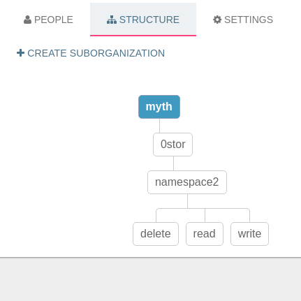

What is 0-stor
==============

- 0-stor is a simple object store where you can save/retrieve small files
in an efficient manner.
- It's designed to leverage the power of [Badger](https://github.com/dgraph-io/badger) A key value store
that works very fast on SSD hard disks.You can read more about Badger [here](https://open.dgraph.io/post/badger/)
- 0-stor provides 2 interfaces
    - REST/HTTP interface
    - [GRPC](https://grpc.io/) interface
- 0-stor depends on [iyo](https://itsyou.online/) for:
    - Authentication & Authorization
    - Every 0-stor collection is tied to an existing [iyo](https://itsyou.online/) organization
    - so there is a convention that 0stor collection names *MUST* follow
        - 0stor collection names convention is `{organization_name}_0stor_{namespace}
         ```0stor``` part is mandatory
        - That says you **MUST** have {organization_name}.0stor.{namespace} sub organization on [iyo](https://itsyou.online/)
        - In most cases it's the responsibility of the client you are using to create proper [iyo](https://itsyou.online/) sub organizations for you
        provided that you have a valid organization


- [iyo](https://itsyou.online/) and How it's used in Authorization
    - Assume we have  [iyo](https://itsyou.online/) organization called ```myth```
    - Now if you want to put an object in 0stor, the collection name must be ```myth_0stor_{any_suffix}``` i.e ```myth_0stor_namespace2```
      So you must have sub organization ```myth.0stor.namespace2``` in [iyo](https://itsyou.online/)
    - Also you must have these sub organizations"
        - ```myth.0stor.namespace2.read```
        - ```myth.0stor.namespace2.delete```
        - ```myth.0stor.namespace2.write```
          
    - The reason we have these sub organizations is because we generate JWT based on them
           - If user is member of ```myth.0stor.namespace2.read``` then user has read access to ```myth.0stor.namespace2``` and so on
